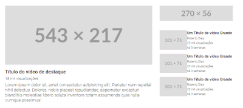

# 🧙‍♂️ Exercício com Grid DevQuest 🧙‍♂️
A ideia era criar um layout inspirado no youtube para treinar o conceito do Display Grid;

O exercício também estimulava o olhar aguçado para layout, no momento que pedia para "*quebrar*" a página em blocos e pensar e um grid 2x2;

*A atividade não pedia para ser responsiva, mas sim para treinar os conceitos aprendidos do grid.*

## 😎 Encerramento 😎
O grid é algo que ainda preciso praticar mais, então partimos pro FrontEnd Mentor e fazemos suas atividades!

Além de começar o JavaScript 👀 !